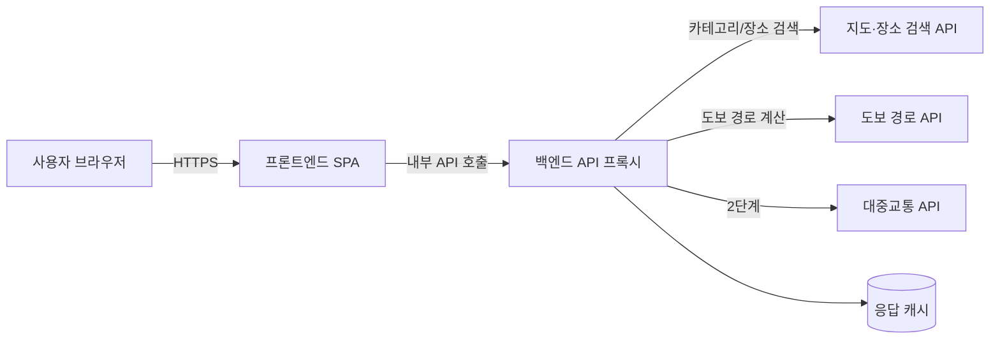

# TRD: 카테고리 기반 국내 지도 앱

## 1. 개요

본 문서는 [prd.md](./prd.md)에 정의된 기능 요구사항(FR-1 ~ FR-20)을 구현하기 위한 기술 요구사항을 정의한다. PRD 11장에 명시된 대로 지도·장소 검색 API와 도보 경로 API는 별도 제공사 조합으로 구성될 가능성이 높으며, 실제 API 조합은 1단계 착수 전 PoC 결과에 따라 확정한다. 본 문서의 API 후보는 PoC 대상 후보이며 확정값이 아니다.

## 2. 시스템 아키텍처 개요



- **프론트엔드**: 지도 렌더링, 카테고리 UI, 장소·경로 패널을 담당하는 SPA. 외부 지도 API 키(공개 가능한 JS 키)는 도메인 제한을 걸어 클라이언트에서 직접 사용하고, 장소 검색·경로 계산처럼 비밀 키가 필요한 호출은 백엔드를 경유한다.
- **백엔드(API 프록시)**: 외부 API 비밀 키 보관, 요청 검증, 응답 정규화(제공사별 응답 스키마 차이를 내부 공통 스키마로 변환), 캐싱, 호출량 제한(rate limit) 담당.
- **외부 API**: 지도·장소 검색, 도보 경로, (2단계) 대중교통 API. 제공사가 서로 다를 수 있음을 전제로 어댑터 패턴으로 분리한다.

## 3. 기술 스택 (PoC 후보)

| 영역 | 후보 | 비고 |
| --- | --- | --- |
| 프론트엔드 | React 또는 Vue 기반 SPA (반응형) | 데스크톱 우선 최적화, 모바일 브레이크포인트 대응 |
| 지도 렌더링·장소 검색 | Kakao Maps JS API + Kakao Local API (대안: Naver Maps) | 카테고리 코드 검색 가능 여부로 1차 후보 |
| 도보 경로 계산 | Tmap 보행자 경로 API (대안: ODsay) | Kakao/Naver는 공개 보행자 경로 API 미제공 확인됨 |
| 대중교통 경로 (2단계) | ODsay 대중교통 길찾기 API | 도보 구간 포함 응답 제공 |
| 백엔드 | Node.js(Express) 또는 서버리스 함수 | API 키 보관 및 프록시 용도, 상태 저장 최소화 |
| 캐시 | 인메모리 캐시(개발) → Redis(운영, 트래픽 증가 시) | 동일 좌표·카테고리 반복 조회 비용 절감 |
| 배포 | 정적 호스팅(프론트) + 서버리스/컨테이너(백엔드) | 초기 비용 최소화 우선 |

## 4. API 연동 설계

### 4.1 어댑터 인터페이스 (제공사 교체 대비)

지도/장소 검색과 도보 경로는 아래와 같은 내부 인터페이스로 추상화해, PoC 이후 제공사가 바뀌어도 프론트엔드·비즈니스 로직에 영향을 주지 않도록 한다.

```
PlaceSearchProvider
  searchByCategory(categoryCode: string, bounds: MapBounds): Place[]
  searchByKeyword(keyword: string, bounds: MapBounds): Place[]

WalkingRouteProvider
  getWalkingRoute(origin: LatLng, destination: LatLng): RouteResult
```

- `Place`, `RouteResult`는 내부 공통 스키마(5장)로 정의하고, 각 제공사 응답을 어댑터에서 이 스키마로 변환한다.
- PC방처럼 카테고리 코드가 없는 카테고리는 `searchByKeyword`로 라우팅한다(PRD 6장 대응).

### 4.2 FR 대비 API 매핑

| FR | 필요 API 기능 |
| --- | --- |
| FR-2 (현재 위치) | 브라우저 Geolocation API |
| FR-3, FR-4 (카테고리 장소 검색) | `PlaceSearchProvider.searchByCategory` |
| FR-5 (화면 영역 재조회) | 지도 이동 이벤트 + `searchByCategory` 재호출(디바운스 적용) |
| FR-6 (장소 상세) | 장소 검색 API 응답의 상세 필드 |
| FR-7 (키워드 검색) | `PlaceSearchProvider.searchByKeyword` |
| FR-12, FR-13 (도보 경로) | `WalkingRouteProvider.getWalkingRoute` |
| FR-14 (최단 경로 추천) | 경로 결과 중 `duration` 최소값 선택 |
| FR-17 (경로 지도 표시) | 경로 API의 polyline/좌표 배열 |
| FR-15, FR-18, FR-19 (2단계 대중교통) | 대중교통 API 연동 (3단계에서 구현) |
| FR-20 (실시간 데이터 실패 시 대체 표시) | API 오류/타임아웃 처리 + 마지막 캐시 갱신 시각 표시 |

## 5. 데이터 모델 (내부 공통 스키마)

```
Place {
  id: string
  name: string
  category: CategoryCode
  address: string
  lat: number
  lng: number
  distanceMeters: number
  openingHours?: string
  phone?: string
  sourceProvider: string   // 원본 API 제공사 식별용
}

RouteResult {
  mode: "walk" | "bus" | "subway" | "mixed"
  durationSeconds: number
  distanceMeters: number
  transferCount: number
  steps: RouteStep[]
  isRealtime: boolean
  lastUpdatedAt: string    // ISO8601, 실시간 데이터 불가 시 대체 표시용(FR-20)
}

RouteStep {
  mode: "walk" | "bus" | "subway"
  polyline: LatLng[]
  lineName?: string        // 지하철 노선명 등 (2단계)
  routeNumber?: string     // 버스 번호 등 (2단계)
  startPoint: LatLng
  endPoint: LatLng
}
```

## 6. 비기능 요구사항

- **성능**: 카테고리 선택 후 지도 마커 표시까지 체감 지연이 없도록 지도 화면 영역 기준으로 결과를 제한 조회하고, 이동/줌 이벤트는 디바운스(예: 300ms)를 적용한다.
- **가용성**: 외부 API 오류·타임아웃 시 화면이 멈추지 않도록 재시도(최대 1회) 후 실패 상태를 사용자에게 표시한다(FR-20).
- **확장성**: 대중교통 API(3단계) 추가 시 기존 어댑터 구조에 `TransitRouteProvider`만 추가하면 되도록 설계한다.
- **브라우저 지원**: 최신 Chrome, Edge 우선 지원. 데스크톱 해상도 우선 최적화 후 모바일 대응.
- **호출량 관리**: 제공사별 무료 호출 한도를 초과하지 않도록 백엔드에서 사용자별/IP별 요청 빈도를 제한한다.

## 7. 보안 요구사항

- 비밀 API 키(장소 검색, 도보 경로 등)는 백엔드 환경 변수로만 관리하고 클라이언트 번들에 포함하지 않는다.
- 클라이언트에 노출되는 지도 JS 키는 등록된 도메인에서만 동작하도록 제공사 콘솔에서 도메인 제한을 설정한다.
- 백엔드 프록시 엔드포인트는 CORS를 허용 출처로 제한하고, 요청 파라미터(좌표, 카테고리 코드 등)를 서버 측에서 검증한다.
- 위치 정보는 사용자 동의 후에만 수집하며, 서버에 좌표를 로깅할 경우 보관 기간과 목적을 최소화한다.
- 외부 API 응답은 그대로 프론트엔드에 전달하지 않고, 필요한 필드만 선별해 내부 스키마로 변환 후 반환한다(불필요한 개인정보·내부 식별자 노출 방지).

## 8. 오류 처리 및 폴백 전략 (FR-20 대응)

| 상황 | 처리 방식 |
| --- | --- |
| 외부 API 타임아웃/오류 | 1회 재시도 → 실패 시 오류 메시지와 함께 마지막 캐시된 결과(있는 경우) 표시 |
| 실시간 데이터 미제공 지역 | "일반 예상값" 라벨과 함께 결과 표시 |
| 카테고리 코드 미지원(PC방 등) | 키워드 검색으로 자동 전환 |
| 도보 경로 계산 불가(경로 없음) | 사용자에게 경로 없음 안내, 대안 없음 |

## 9. 배포·운영

- 프론트엔드는 정적 호스팅(예: Vercel, Netlify 등)으로 배포하고, 백엔드 프록시는 서버리스 함수 또는 소규모 컨테이너로 배포해 초기 운영 비용을 최소화한다.
- 환경 변수(API 키)는 배포 플랫폼의 시크릿 관리 기능을 사용하고 저장소에 커밋하지 않는다.
- 외부 API 호출 실패율, 응답 시간, 호출량을 기본 로그로 남겨 무료 호출 한도 초과 여부를 조기에 파악한다.

## 10. 미해결 기술 사항

- 지도/장소 검색·도보 경로 API 최종 선정 (PRD 14장 PoC 대상, 1단계 착수 조건)
- 백엔드 프록시의 구체적 배포 대상(서버리스 vs 상시 서버) 결정
- 캐시 계층 도입 시점 및 TTL 정책
- 좌표·검색 로그의 보관 기간 정책

## 11. 참고

본 문서는 [prd.md](./prd.md)의 기능 요구사항을 기반으로 기술 구현 방향을 정의한 것이며, PoC 결과에 따라 3장(기술 스택 후보)과 4장(API 연동 설계)의 세부 내용은 변경될 수 있다.
